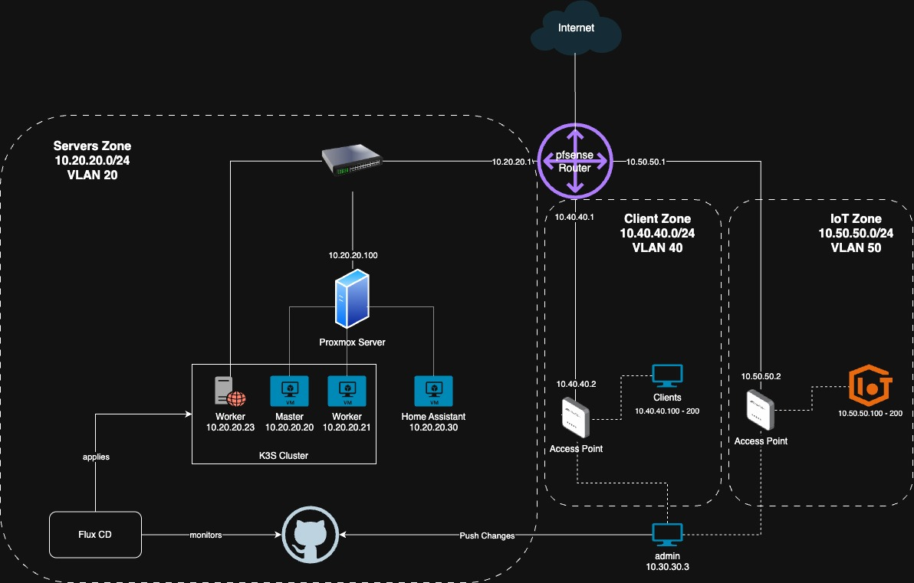

# HomeLab Automation Project

A comprehensive Kubernetes homelab setup using K3s, Flux CD, MetalLB, and Ansible for infrastructure automation.

## Table of Contents

- [Physical Infrastructure](#physical-infrastructure)
- [Networking](#networking)
- [Flux CD](#flux-cd)
- [MetalLB](#metallb)
- [Ansible](#ansible)
- [Kube-VIP](#kube-vip)
- [Node Management](#node-management)
- [Monitoring](#monitoring)
- [Troubleshooting](#troubleshooting)

## Physical Infrastructure

My homelab utilizes a pfSense router that serves as a DHCP server, DNS resolver, and firewall, with one of its interfaces dedicated to a Proxmox server where all the Kubernetes infrastructure runs.



## Networking

### Useful Commands

```bash
# Node labeling
kubectl label node $NODE_NAME key=value
kubectl label node $NODE_NAME key-  # Remove a label
kubectl get nodes --show-labels

# Traefik troubleshooting
kubectl logs -n kube-system deployment/traefik
kubectl rollout restart deployment/traefik -n kube-system
kubectl rollout restart deployment controller -n metallb-system  # Useful if IP address isn't changing
```

## Flux CD

I use Flux CD for two primary purposes:

1. **GitOps Automation**: Monitor manifest changes in my repository and automatically update the K3s cluster
2. **Image Automation**: Monitor GitHub packages and apply new images upon creation (built via GitHub Actions + Dockerfile)

### Installation

#### Prerequisites

1. Create a GitHub personal access token
2. Install Flux CLI:

```bash
curl -s https://fluxcd.io/install.sh | sudo bash
export GITHUB_TOKEN=$TOKEN
```

#### Bootstrap Installation

```bash
flux bootstrap github \
    --owner=$GITHUB_USER \
    --repository=home-lab \
    --branch=main \
    --path=clusters/homelab \
    --components-extra=image-reflector-controller,image-automation-controller \
    --personal
```

**Note**: The extra components enable pulling built GitHub images from the repository.

#### GitHub Registry Authentication

```bash
kubectl create secret docker-registry ghcr-credentials \
    --namespace=development \
    --docker-server=ghcr.io \
    --docker-username=$GITHUB_USER \
    --docker-password=$GITHUB_TOKEN
```

**NOTE**: if you're wanting to create a generic secret for the repo which isn't used for the docker-registry you can do so with something like this:

```
kubectl create secret generic git-credentials \
    --namespace=production \
    --from-literal=username=$GITHUB_USER \
    --from-literal=password=$GITHUB_TOKEN --dry-run-client -o yaml
```

**Important**: Ensure environment variables are exported before running.

### Troubleshooting Commands

```bash
# Check Flux controller logs
kubectl logs -n flux-system deployment/kustomize-controller

# Verify Git repository status
flux get source git flux-system  # Shows last commit - compare with git logs

# Force reconciliation
flux reconcile kustomization metallb --with-source  # Force reconcile if changes aren't picked up

# Emergency reset (use with caution)
kubectl delete kustomization metallb-system -n flux-system  # Delete and recreate if needed
```

### Flux Concepts

- **Two types of Kustomizations**:

  1. **Repository Kustomizations**: Specify the location of repository files (e.g., MetalLB files) - typically located in the flux-system folder
  2. **Resource Kustomizations**: Specify actual resources (e.g., metallb/base → ip-address-pool.yaml)

- **Node Labeling**: Add labels to specific nodes with `kubectl label node hostname key=value` - useful for limiting MetalLB speaker advertisements to certain nodes

## MetalLB

In cloud environments, external IPs are automatically allocated for load balancers. MetalLB provides this functionality for local Kubernetes clusters by assigning external IPs to load balancer services.

### Setup

Following a GitOps approach, I push manifest changes and let Flux CD automatically apply them locally.

#### Installation Steps

1. **Install MetalLB** (initially installed directly on primary server node, but should be placed in MetalLB kustomization for future deployments)
2. **Create Kustomization** in flux-system to identify MetalLB file locations (e.g., `clusters/homelab/metallb/base`)
3. **Create Resources** in the specified location:
   - IP address pool
   - L2 advertisement (or BGP if preferred)
   - Kustomization that identifies your resources

**Recommendation**: Set up Flux CD first for a seamless experience.

#### Result

After setup, load balancer services (e.g., Traefik) will have external IP addresses associated with them.

**Note**: With multiple control nodes, a speaker DaemonSet is used where each node has a speaker ready to advertise the address pool. You can limit which nodes "speak" by updating the DaemonSet manifest with nodeSelector.

### Useful Commands

```bash
# Check MetalLB speaker logs
kubectl logs -n metallb-system -l app=metallb,component=speaker

# Test VIP connectivity (run from same subnet)
arping -I eth0 $VIP
```

## Ansible

During my learning process, I found it easier to destroy and recreate VMs when encountering major issues. After using Terraform for infrastructure, I could quickly reprovision nodes using Ansible.

**Best Practice**: Manual setup first, then automate with Ansible. This solidifies understanding and provides quick iteration for troubleshooting.

### Installation

```bash
# macOS installation
brew install ansible
brew install ansible-lint  # For playbook linting

# Verify installation
ansible --version
```

### Key Concepts

Ansible has several key concepts (I'm still learning):

1. **Inventory**: Required for Ansible to connect to hosts (see [hosts.yaml](./homelab-infra/ansible/inventory/hosts.yaml))

   - [Ansible Inventory Documentation](https://docs.ansible.com/ansible/latest/getting_started/get_started_inventory.html)

2. **Plays and Playbooks**: Ansible modules (similar to Linux commands) used declaratively in playbooks to specify parameters and sequential tasks (see [1-base-setup.yaml](./homelab-infra/ansible/playbooks/1-base-setup.yaml))

3. **Templates and Variables**: Reduce code duplication and hardcoded values
   - **Vaults**: Special variables for secrets (e.g., GitHub tokens for Flux)
   - [Example playbook using vault](./homelab-infra/ansible/playbooks/5-flux-gitops-setup.yaml)

#### Vault Commands

```bash
ansible-vault create /path/to/vault.yml
ansible-vault view /path/to/vault.yml
ansible-vault edit /path/to/vault.yml
ansible-playbook /path/to/playbook.yaml --ask-vault-pass
```

#### Useful Commands

```bash
# Run playbook with verbosity
ansible-playbook -vvv your_playbook.yml  # Verbosity levels 1-3
```

## Kube-VIP

I modeled best practices with the goal of hosting external sites. The concept is that control plane nodes (3 server nodes in my case) provide redundancy for agents. If one server node goes down, another will be used by the agents. A Virtual IP is created for agents to connect to their master.

## Node Management

### Process for Replacing a Node

```bash
# First, add a new node, then perform the following:

# On master node - get node token
sudo cat /var/lib/rancher/k3s/server/node-token

# On new node - join cluster
curl -sfL https://get.k3s.io | K3S_URL=https://<MASTER-IP>:6443 K3S_TOKEN=<NODE-TOKEN> sh -

# Drain and remove old node
kubectl drain <vm-node-name> --ignore-daemonsets --delete-local-data
kubectl delete node <vm-node-name>
```

## Monitoring

### Kubernetes Dashboard

Installation instructions are available [here](https://kubernetes.io/docs/tasks/access-application-cluster/web-ui-dashboard/).

The official documentation was partially helpful. Additional steps required after port forwarding:

1. **Create admin-user ServiceAccount**:

   ```bash
   kubectl create serviceaccount admin-user -n kubernetes-dashboard
   ```

2. **Bind to cluster-admin role**:

   ```bash
   kubectl create clusterrolebinding admin-user \
    --clusterrole=cluster-admin \
    --serviceaccount=kubernetes-dashboard:admin-user
   ```

3. **Generate admin token**:
   ```bash
   kubectl -n kubernetes-dashboard create token admin-user
   ```
   **Warning**: Don't use this in production!

**Alternative**: Instead of port-forwarding, use `kubectl proxy` and navigate to:
`http://localhost:8001/api/v1/namespaces/kubernetes-dashboard/services/https:kubernetes-dashboard:/proxy/`

## Troubleshooting

### My Questions (Understanding + Confidence)

- In Flux, what exactly are patches and what is their relationship with related manifests?
- What command allows me to view and verify that kube-vip election leader changes are taking place?

### Common Issues

- **IP Address Not Changing**: Restart Traefik and MetalLB controller deployments
- **Flux Not Syncing**: Check kustomize-controller logs and force reconciliation
- **Node Joining Issues**: Verify node tokens and network connectivity

## Backups

At this point in time I am running a single Proxmox Server on an Optiplex Micro (7050) with 16GB RAM. Soon I will have an additional Orange Pi 5 Max integrated as an additional node.

Therefore at the moment I'm planning on utilising Proxmox Backup Feature, which is really very good.

### Creating Backup Job in Proxmox

1. Click on DataCenter and navigate to Backups.
2. Add Backup
3. Select the VMs I'm looking to backup, use Retention, Schedule and Storage as appropriate.

### Storage location

I don't currently have NAS, so I plan on simply attaching an external drive to my router and using that for now.

In the future I would like to use SMB to save to NAS.
