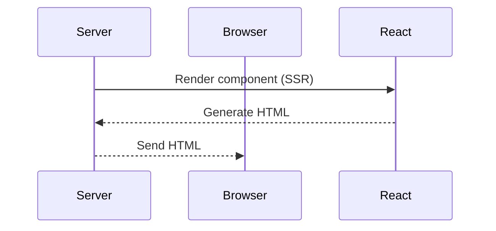
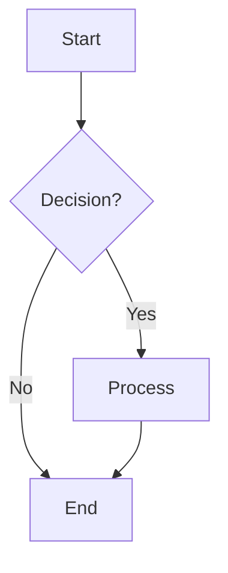

<Cover src="/mermaid.png" alt="Mermaid Diagrams" />

Mermaid diagrams are a powerful way to visualize complex flows, architectures, and relationships in technical documentation. When building a Next.js blog with MDX, integrating Mermaid diagrams can be surprisingly challenging due to the complexity of MDX processing pipelines.

**Note**: In this article, inline code snippets use the `<InlineCode>` component since our current MDX setup doesn't recognize single backticks for inline code formatting.

In this article, I'll walk through our journey of adding Mermaid diagrams to our Next.js blog, the challenges we encountered, and the solution we ultimately implemented.

## The Setup: Next.js + MDX

Our blog uses Next.js 15 with MDX for content management. The basic setup includes:

```tsx
// next.config.mjs
import createMDX from '@next/mdx'
import remarkMdxFrontmatter from 'remark-mdx-frontmatter'

const withMDX = createMDX({
  extension: /\.mdx?$/,
  options: {
    remarkPlugins: [remarkMdxFrontmatter],
  },
})

export default withMDX(nextConfig)
```

We use `MDXRemote` for rendering blog posts, which allows us to use frontmatter for metadata like titles, dates, and tags:

```tsx
// app/blog/[slug]/page.tsx
import { MDXRemote } from 'next-mdx-remote/rsc'
import { mdxComponents } from '@/mdx-components'

export default async function BlogPostPage({ params }: BlogPageProps) {
  const { content } = matter(file)

  return (
    <article>
      <MDXRemote source={content} components={mdxComponents} />
    </article>
  )
}
```

## The Challenge: MDX Processing Pipeline

When you write a Mermaid diagram in MDX:

````mdx

````

````

MDX processes this through several stages:

1. **Markdown → MDX AST**: The markdown is parsed into an abstract syntax tree
2. **AST → React Components**: The AST is transformed into React component calls
3. **Component Rendering**: React renders the final JSX

The challenge is that MDX standardizes all code blocks into the same structure:

```tsx
<pre>
  <code className="language-mermaid">
    sequenceDiagram
    participant Server
    participant Browser
    ...
  </code>
</pre>
````

## Our Initial Approach: rehype-mermaid

We started with the `rehype-mermaid` plugin, which processes Mermaid blocks during the build phase:

```tsx
// next.config.mjs (initial attempt)
import rehypeMermaid from 'rehype-mermaid'

const withMDX = createMDX({
  options: {
    rehypePlugins: [
      [
        rehypeMermaid,
        {
          strategy: 'img-svg',
          mermaidConfig: { theme: 'default' },
        },
      ],
    ],
  },
})
```

**The Problem**: `rehype-mermaid` wasn't consistently processing our Mermaid blocks. Sometimes it would work, sometimes it wouldn't, and debugging the MDX processing pipeline was complex.

**Why rehype-mermaid was appealing**: It processes Mermaid diagrams at build time, converting them to static SVG images. This approach is efficient because it eliminates client-side JavaScript and provides faster initial page loads.

**The difference with client-side rendering**: Our client-side approach renders diagrams dynamically in the browser, which gives us more control over styling, interactivity, and debugging, but requires the Mermaid library to be loaded on the client.

## The Solution: Client-Side Rendering

We switched to a client-side approach using a custom Mermaid component. First, we installed the Mermaid library:

```bash
npm install mermaid
```

The Mermaid library provides the core diagram rendering functionality. Our custom component wraps this library to handle React-specific concerns like lifecycle management and DOM manipulation:

```tsx
// components/ui/mermaid.tsx
'use client'

import mermaid from 'mermaid'
import { useEffect, useRef, useState } from 'react'

// Global flag to ensure mermaid is only initialized once
let mermaidInitialized = false

export default function Mermaid({ children, className }: MermaidProps) {
  const elementRef = useRef<HTMLDivElement>(null)
  const [isRendered, setIsRendered] = useState(false)
  const [mounted, setMounted] = useState(false)

  // Create a stable ID based on content hash to avoid hydration issues
  const createStableId = (content: string) => {
    let hash = 0
    for (let i = 0; i < content.length; i++) {
      const char = content.charCodeAt(i)
      hash = (hash << 5) - hash + char
      hash = hash & hash // Convert to 32-bit integer
    }
    return `mermaid-${Math.abs(hash).toString(36)}`
  }

  const diagramId = useRef(createStableId(children))

  // Handle mounting to avoid hydration issues
  useEffect(() => {
    setMounted(true)
  }, [])

  useEffect(() => {
    if (!elementRef.current || isRendered || !mounted) return

    // Ensure children is a string
    let code = children
    if (Array.isArray(code)) {
      code = code.join('')
    }
    if (typeof code !== 'string') {
      code = String(code)
    }

    // Initialize mermaid only once globally
    if (!mermaidInitialized) {
      mermaid.initialize({
        startOnLoad: false,
        theme: 'default',
        securityLevel: 'loose',
        fontFamily: 'monospace',
      })
      mermaidInitialized = true
    }

    // Render the diagram
    mermaid
      .render(diagramId.current, code)
      .then(({ svg }) => {
        if (elementRef.current) {
          elementRef.current.innerHTML = svg
          setIsRendered(true)
        }
      })
      .catch((error) => {
        console.error('Mermaid rendering error:', error)
      })
  }, [children, isRendered, mounted])

  // Show a loading state until mounted to avoid hydration mismatch
  if (!mounted) {
    return (
      <div
        className={`mermaid-container ${className || ''}`}
        style={{
          display: 'flex',
          justifyContent: 'center',
          margin: '2rem 0',
          overflow: 'auto',
          minHeight: '200px',
          alignItems: 'center',
        }}
      >
        <div className="text-gray-500">Loading diagram...</div>
      </div>
    )
  }

  return (
    <div
      ref={elementRef}
      className={`mermaid-container ${className || ''}`}
      style={{
        display: 'flex',
        justifyContent: 'center',
        margin: '2rem 0',
        overflow: 'auto',
        minHeight: '200px',
      }}
    />
  )
}
```

## Handling the MDX Processing

The key insight was understanding how MDX passes content to components. We created a custom `pre` component that detects Mermaid blocks:

**The Key Insight**: MDX standardizes all code blocks into a consistent structure (`<pre><code>`), but the actual content is nested within the `children` prop of the `<code>` element. By inspecting the `className` of the `<code>` element, we can determine if it's a Mermaid block and extract the diagram syntax from its `children` prop.

```tsx
// mdx-components.tsx
function CustomPre(props: React.ComponentProps<'pre'>) {
  const { children, ...rest } = props

  // Extract code content and check if it's Mermaid
  let isMermaid = false
  let codeClassName = ''
  let mermaidCode = ''

  if (children && typeof children === 'object' && 'props' in children) {
    const childrenProps = children.props as {
      className?: string
      children?: string
    }
    codeClassName = childrenProps.className || ''
    mermaidCode = childrenProps.children || ''
    isMermaid = codeClassName.includes('language-mermaid')
  }

  // Route to appropriate component
  if (isMermaid) {
    return <Mermaid className={codeClassName}>{mermaidCode}</Mermaid>
  }

  return (
    <CodeBlock className={codeClassName} {...rest}>
      {children}
    </CodeBlock>
  )
}

export const mdxComponents = {
  pre: CustomPre,
  // ... other components
}
```

## The Hydration Challenge

During development, we encountered a hydration error that was particularly tricky to debug:

```
Hydration failed because the server rendered HTML didn't match the client.
This can happen if a SSR-ed Client Component used variable input such as
Date.now() or Math.random() which changes each time it's called.
```

**The Problem**: Our initial Mermaid component used `Date.now()` to generate unique IDs:

```tsx
// ❌ Problematic - causes hydration errors
mermaid.render(`mermaid-${Date.now()}`, children)
```

This created different values on server vs client, causing React's hydration mismatch.

**The Solution**: We implemented a content-based hash function for stable IDs:

```tsx
// ✅ Fixed - stable, deterministic IDs
const createStableId = (content: string) => {
  let hash = 0
  for (let i = 0; i < content.length; i++) {
    const char = content.charCodeAt(i)
    hash = (hash << 5) - hash + char
    hash = hash & hash
  }
  return `mermaid-${Math.abs(hash).toString(36)}`
}
```

We also added a mounting state to ensure consistent rendering:

```tsx
const [mounted, setMounted] = useState(false)

// Show loading state until mounted
if (!mounted) {
  return <div>Loading diagram...</div>
}
```

This ensures the server and client render the same content initially, preventing hydration errors.

## Why This Approach Works Better

1. **Consistent Processing**: We handle the standardized MDX output format
2. **Language Agnostic**: Works for any code block language
3. **Client-Side Control**: Full control over Mermaid rendering
4. **No Build Dependencies**: Doesn't rely on complex rehype plugins
5. **Better Debugging**: Easier to debug and maintain
6. **Hydration Safe**: Stable IDs and consistent rendering prevent SSR/client mismatches

## The Children Inconsistency

One interesting challenge we encountered was the inconsistency of the `children` prop format. MDX passes different types of content:

- **React elements**: `<code>` elements with `props.children` containing the actual code
- **Direct strings**: Sometimes the content is passed directly
- **Complex objects**: Nested structures from MDX processing

Our solution handles all cases:

```tsx
// Extract actual code content from children
let code = ''
if (typeof children === 'string') {
  code = children
} else if (children && typeof children === 'object' && 'props' in children) {
  const childrenProps = children.props as { children?: string }
  code = childrenProps.children || ''
} else {
  code = children?.toString() || ''
}
```

## Final Result

With this setup, we can now include Mermaid diagrams in our blog posts:



The diagrams render as interactive SVGs on the client side, and our regular code blocks maintain their copy functionality.

## Key Takeaways

1. **MDX Processing is Complex**: The transformation pipeline can be unpredictable
2. **Client-Side Rendering is Reliable**: More control and easier debugging
3. **Handle Children Carefully**: MDX passes content in various formats
4. **Custom Components Provide Flexibility**: Better than relying on plugins

## Resources

- [Mermaid Documentation](https://mermaid.js.org/)
- [Next.js MDX Documentation](https://nextjs.org/docs/app/building-your-application/routing/mdx)
- [MDX Processing Pipeline](https://mdxjs.com/docs/advanced/plugins/)

This approach gives us reliable Mermaid diagram rendering while maintaining the flexibility and performance of our Next.js blog setup.
